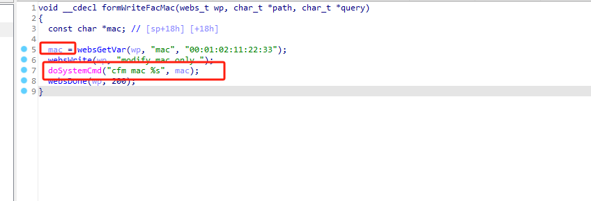
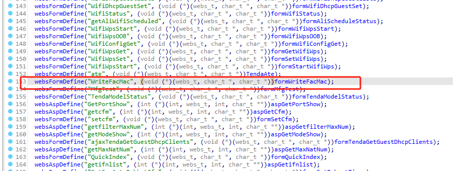
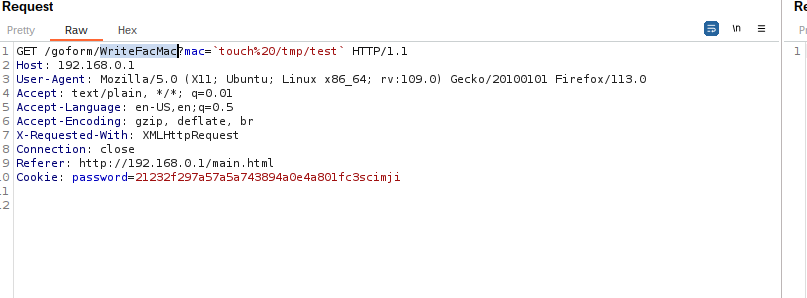
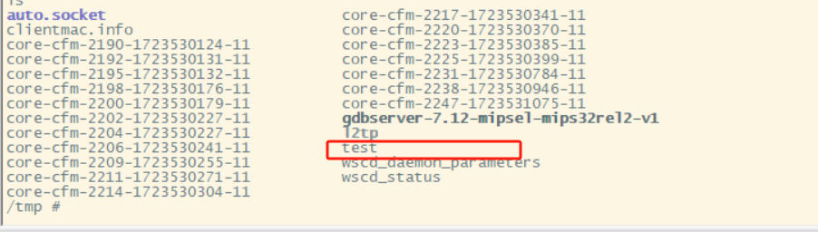

# tenda_ac6_rce_WriteFacMac

The parameter mac in the function formWriteFacMac is concatenated and causes the execution of a system command.

 the front-end is calling an API endpoint named WriteFacMac, which is likely a GET request that sends a MAC address to the server.
 

 the command execution was successfuls