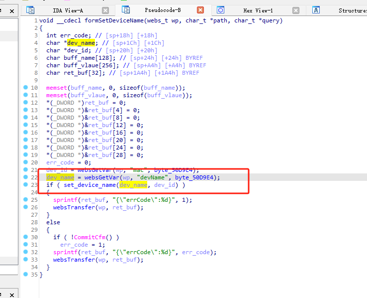
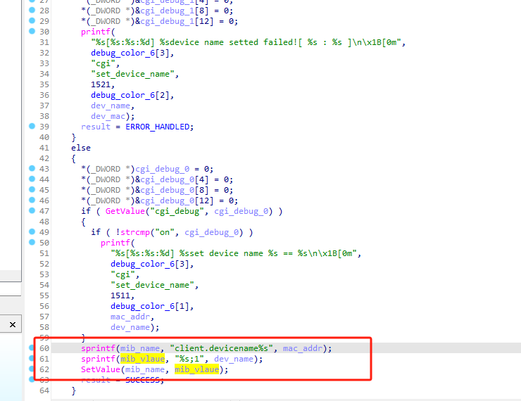
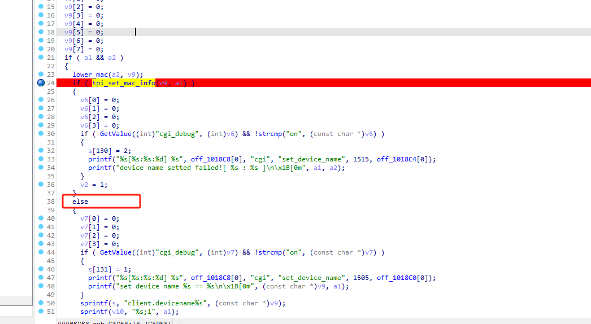
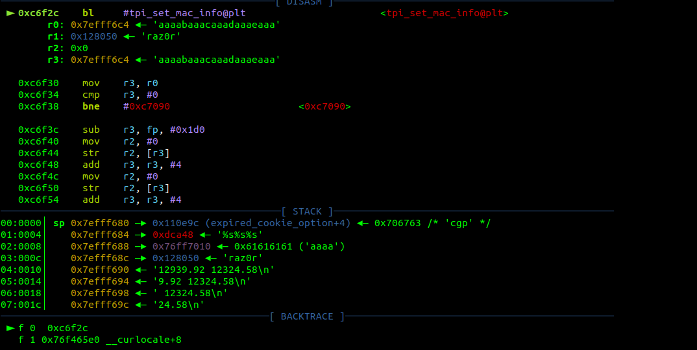
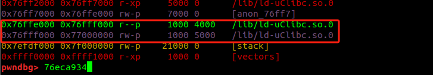
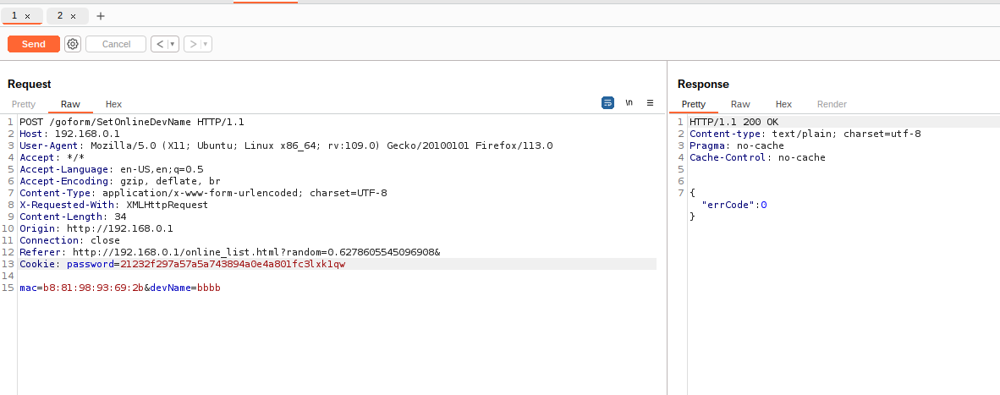
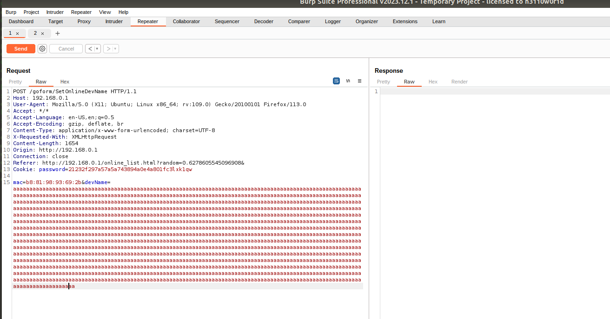

# tenda_ac6_stackflow_formSetDeviceName

The devName function in the formSetDeviceName function causes a stack overflow.After constructing the ROP chain, malicious code can be executed.



After obtaining the mac and devName parameters, enter the set_device_name



After concatenation, a stack overflow occurs.
During dynamic debugging, it is found that the function needs to return 0 in order to reach the stack overflow point.







ni execution, after passing the PLT table, jumps to the formal address, which is 0x76eca934.




Determined to be in /lib/ld-uClibc.so.0.
However, only the corresponding assembly code was found here:

```

 0x76eca934 <+0>:	push	{r4, r11, lr}
   0x76eca938 <+4>:	add	r11, sp, #8
   0x76eca93c <+8>:	sub	sp, sp, #396	; 0x18c
   0x76eca940 <+12>:	ldr	r4, [pc, #412]	; 0x76ecaae4 <tpi_set_mac_info+432>
   0x76eca944 <+16>:	add	r4, pc, r4
   0x76eca948 <+20>:	str	r0, [r11, #-400]	; 0xfffffe70
   0x76eca94c <+24>:	str	r1, [r11, #-404]	; 0xfffffe6c
   0x76eca950 <+28>:	mov	r0, #1
   0x76eca954 <+32>:	mov	r1, #1
   0x76eca958 <+36>:	mov	r2, #0
   0x76eca95c <+40>:	bl	0x76e85c14 <socket@plt>
   0x76eca960 <+44>:	str	r0, [r11, #-16]
   0x76eca964 <+48>:	ldr	r3, [r11, #-16]
   0x76eca968 <+52>:	cmp	r3, #0
   0x76eca96c <+56>:	bge	0x76eca988 <tpi_set_mac_info+84>
   0x76eca970 <+60>:	ldr	r3, [pc, #368]	; 0x76ecaae8 <tpi_set_mac_info+436>
   0x76eca974 <+64>:	add	r3, r4, r3
   0x76eca978 <+68>:	mov	r0, r3
   0x76eca97c <+72>:	bl	0x76e85aac <puts@plt>
   0x76eca980 <+76>:	mov	r3, #255	; 0xff
   0x76eca984 <+80>:	b	0x76ecaad8 <tpi_set_mac_info+420>
   0x76eca988 <+84>:	sub	r3, r11, #392	; 0x188
   0x76eca98c <+88>:	mov	r0, r3
   0x76eca990 <+92>:	mov	r1, #0
   0x76eca994 <+96>:	mov	r2, #110	; 0x6e
   0x76eca998 <+100>:	bl	0x76e86358 <memset@plt>
   0x76eca99c <+104>:	movw	r3, #65156	; 0xfe84
   0x76eca9a0 <+108>:	movt	r3, #65535	; 0xffff
   0x76eca9a4 <+112>:	mov	r2, #1
   0x76eca9a8 <+116>:	sub	r1, r11, #12
   0x76eca9ac <+120>:	strh	r2, [r1, r3]
   0x76eca9b0 <+124>:	ldr	r3, [pc, #308]	; 0x76ecaaec <tpi_set_mac_info+440>
   0x76eca9b4 <+128>:	add	r3, r4, r3
   0x76eca9b8 <+132>:	sub	r2, r11, #392	; 0x188
   0x76eca9bc <+136>:	add	r2, r2, #2
   0x76eca9c0 <+140>:	mov	r0, r2
   0x76eca9c4 <+144>:	mov	r1, r3
   0x76eca9c8 <+148>:	mov	r2, #17
   0x76eca9cc <+152>:	bl	0x76e85a4c <memcpy@plt>
   0x76eca9d0 <+156>:	sub	r3, r11, #392	; 0x188
   0x76eca9d4 <+160>:	ldr	r0, [r11, #-16]
   0x76eca9d8 <+164>:	mov	r1, r3
   0x76eca9dc <+168>:	mov	r2, #110	; 0x6e
   0x76eca9e0 <+172>:	bl	0x76e85818 <connect@plt>
   0x76eca9e4 <+176>:	str	r0, [r11, #-20]	; 0xffffffec
   0x76eca9e8 <+180>:	ldr	r3, [r11, #-20]	; 0xffffffec
   0x76eca9ec <+184>:	cmp	r3, #0
   0x76eca9f0 <+188>:	bge	0x76ecaa08 <tpi_set_mac_info+212>
   0x76eca9f4 <+192>:	ldr	r3, [pc, #244]	; 0x76ecaaf0 <tpi_set_mac_info+444>
   0x76eca9f8 <+196>:	add	r3, r4, r3
   0x76eca9fc <+200>:	mov	r0, r3
   0x76ecaa00 <+204>:	bl	0x76e85aac <puts@plt>
   0x76ecaa04 <+208>:	b	0x76ecaacc <tpi_set_mac_info+408>
   0x76ecaa08 <+212>:	sub	r3, r11, #280	; 0x118
   0x76ecaa0c <+216>:	mov	r0, r3
   0x76ecaa10 <+220>:	mov	r1, #0
   0x76ecaa14 <+224>:	mov	r2, #256	; 0x100
   0x76ecaa18 <+228>:	bl	0x76e86358 <memset@plt>
   0x76ecaa1c <+232>:	sub	r3, r11, #280	; 0x118
   0x76ecaa20 <+236>:	str	r3, [r11, #-24]	; 0xffffffe8
   0x76ecaa24 <+240>:	ldr	r3, [r11, #-24]	; 0xffffffe8
   0x76ecaa28 <+244>:	mov	r2, #5
   0x76ecaa2c <+248>:	strb	r2, [r3]
   0x76ecaa30 <+252>:	ldr	r3, [r11, #-24]	; 0xffffffe8
   0x76ecaa34 <+256>:	mov	r2, #0
   0x76ecaa38 <+260>:	strb	r2, [r3, #1]
   0x76ecaa3c <+264>:	mov	r2, #0
   0x76ecaa40 <+268>:	strb	r2, [r3, #2]
   0x76ecaa44 <+272>:	mov	r2, #0
   0x76ecaa48 <+276>:	strb	r2, [r3, #3]
   0x76ecaa4c <+280>:	mov	r2, #0
   0x76ecaa50 <+284>:	strb	r2, [r3, #4]
   0x76ecaa54 <+288>:	ldr	r3, [r11, #-24]	; 0xffffffe8
   0x76ecaa58 <+292>:	add	r3, r3, #5
   0x76ecaa5c <+296>:	mov	r0, r3
   0x76ecaa60 <+300>:	ldr	r1, [r11, #-400]	; 0xfffffe70
   0x76ecaa64 <+304>:	mov	r2, #18
   0x76ecaa68 <+308>:	bl	0x76e85a4c <memcpy@plt>
   0x76ecaa6c <+312>:	ldr	r3, [r11, #-24]	; 0xffffffe8
   0x76ecaa70 <+316>:	add	r3, r3, #23
   0x76ecaa74 <+320>:	mov	r0, r3
   0x76ecaa78 <+324>:	ldr	r1, [r11, #-404]	; 0xfffffe6c
   0x76ecaa7c <+328>:	mov	r2, #64	; 0x40
   0x76ecaa80 <+332>:	bl	0x76e85a4c <memcpy@plt>
   0x76ecaa84 <+336>:	sub	r3, r11, #280	; 0x118
   0x76ecaa88 <+340>:	ldr	r0, [r11, #-16]
   0x76ecaa8c <+344>:	mov	r1, r3
   0x76ecaa90 <+348>:	mov	r2, #256	; 0x100
   0x76ecaa94 <+352>:	bl	0x76e85eb4 <write@plt>
   0x76ecaa98 <+356>:	str	r0, [r11, #-20]	; 0xffffffec
   0x76ecaa9c <+360>:	ldr	r3, [r11, #-20]	; 0xffffffec
   0x76ecaaa0 <+364>:	cmp	r3, #0
   0x76ecaaa4 <+368>:	bge	0x76ecaabc <tpi_set_mac_info+392>
   0x76ecaaa8 <+372>:	ldr	r3, [pc, #68]	; 0x76ecaaf4 <tpi_set_mac_info+448>
   0x76ecaaac <+376>:	add	r3, r4, r3
   0x76ecaab0 <+380>:	mov	r0, r3
   0x76ecaab4 <+384>:	bl	0x76e85aac <puts@plt>
   0x76ecaab8 <+388>:	b	0x76ecaacc <tpi_set_mac_info+408>
   0x76ecaabc <+392>:	ldr	r0, [r11, #-16]
   0x76ecaac0 <+396>:	bl	0x76e86a54 <close@plt>
   0x76ecaac4 <+400>:	mov	r3, #0
   0x76ecaac8 <+404>:	b	0x76ecaad8 <tpi_set_mac_info+420>
   0x76ecaacc <+408>:	ldr	r0, [r11, #-16]
   0x76ecaad0 <+412>:	bl	0x76e86a54 <close@plt>
   0x76ecaad4 <+416>:	mov	r3, #255	; 0xff
   0x76ecaad8 <+420>:	mov	r0, r3
   0x76ecaadc <+424>:	sub	sp, r11, #8
   0x76ecaae0 <+428>:	pop	{r4, r11, pc}
   0x76ecaae4 <+432>:	andeq	r0, r2, r4, asr r9

```
To ensure that the tpi_set_mac_info function returns 0, we need to guarantee that the socket connection is established successfully, data is sent successfully, and the socket is closed successfully. We can ensure the function executes successfully by checking the return values of the socket connection, data sending, and socket closing.

Therefore, we need to ensure that a0 contains {"mac": "BA:71:E8:E0:11:5B","devName":payload}, and the MAC address matches the device, so that the function will continue executing to the else branch.

Then, a stack overflow will occur at the following location.


Environment issue, the program needs to be tested on a physical machine.







The program crashed.


