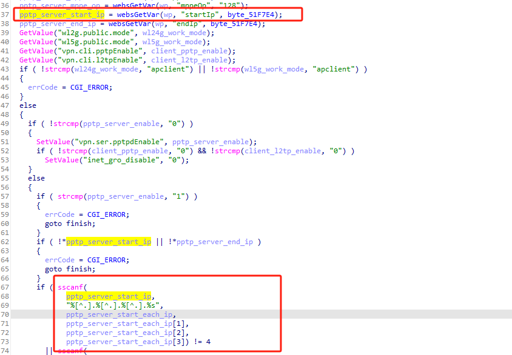
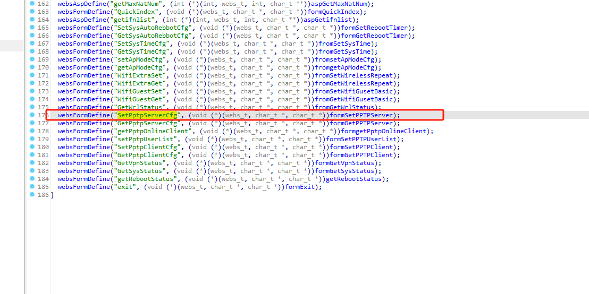
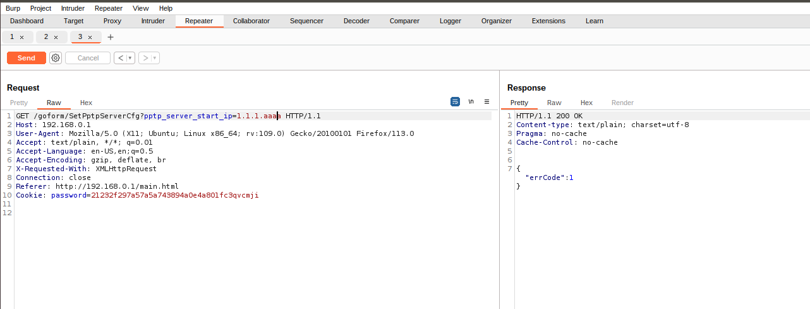
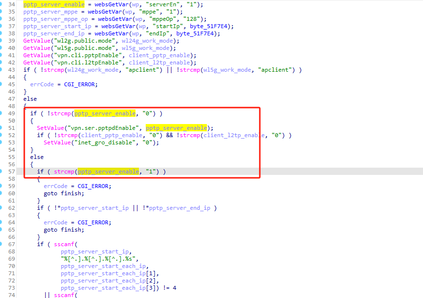
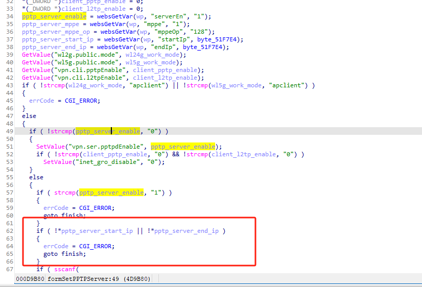

# tenda_ac6_stackoverflower_formSetPPTPServer

函数formSetPPTPServer中的startIp 传递到后面sscanf会导致栈溢出。

前端接口为SetPptpServerCfg

显示了errcode 1 

这里需要pptp_server_enable不等于0，需要等于1才能执行到危险函数sscanf。

还得先设置pptp_server_start_ip和pptp_server_end_ip的值 